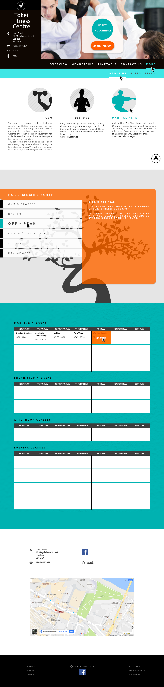

# Tokei's Website

This is a website I built in 2017 for a gym.

## Technologies used:

* PHP
* CSS
* JavaScript - JQuery

## My contribution and what I have learned

* I got in touch with the client and discussed an update for their website.
* I provided him with laptop and mobile website mockups designed with Photoshop.
* I wrote the code to generate a responsive website using:
  * Media queries
  * JQuery
  * Google Maps API
  * Contact form with SWIFTmailer
  * HTML tab component

## Website Screenshots
<space><space>

### Laptop version

### Mobile version

